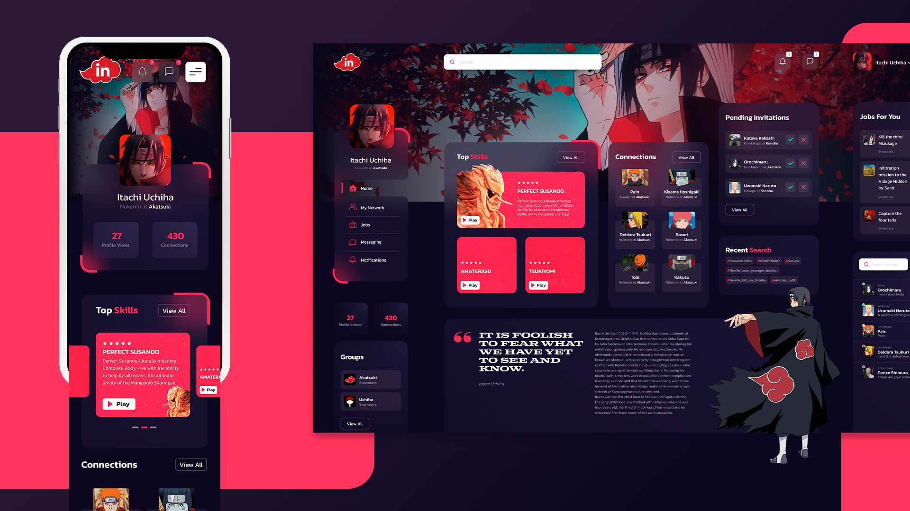

<h1 align="center">
  
</h1>

<h4 align="center" style="margin-bottom: 48px;">A redesign of LinkedIn made by  <a href="https://www.instagram.com/danielsnows/" style="color: #FD2B53;" target="_blank">@danielsnows</a> and built by me with <a href="https://reactjs.org/" style="color: #FD2B53;" target="_blank">React.js</a> and <a href="https://www.typescriptlang.org/" style="color: #FD2B53;" target="_blank">TypeScript</a>.</h4>

<p align="center">
  <a href="#rocket-languages-and-tools">Languages and Tools</a> •
  <a href="#computer-how-to-use">How To Use</a> •
  <a href="#mailbox_with_mail-credits">Credits</a>
</p>

<h1 align="center">
    
</h1>
<h4 align="center" style="margin-bottom: 48px;">You can view the <a href="https://www.figma.com/file/IFfQT5OdPtUf6mse1lkuP2/Itachi-Linkedin?node-id=1%3A2" style="color: #FD2B53; font-weight:bold" target="_blank">Figma Project here</a></h4>

## :rocket: Languages and Tools

<p align="left">
  <a href="https://www.w3.org/html/" target="_blank"> 
     
  </a> 
  <a href="https://www.w3schools.com/css/" target="_blank"> 
     
  </a>

  <a href="https://reactjs.org/" target="_blank">
    
  </a>
  <a href="https://www.typescriptlang.org/" target="_blank">
    
  </a>
 
  <a href="https://www.figma.com/" target="_blank"> 
   
  </a> 
  <a href="https://www.adobe.com/in/products/illustrator.html" target="_blank"> 
   
  </a> 

</p>

## :computer: How To Use
To clone and run this application, you'll need Git and Node.js (which comes with npm or yarn) installed on your computer. From your command line:

```bash
# Clone this repository
$ git clone https://github.com/vinicius-r-s/Itachi-Linkedin.git

# Go into the repository
$ cd Itachi-Linkedin

# Install dependencies
$ npm i
# Or
$ yarn

# Run the app
$ npm start
# Or
$ yarn start
```

## :mailbox_with_mail: Credits

Follow the original author:
<a href="https://www.instagram.com/danielsnows/" style="color: #FD2B53;" target="_blank">@danielsnows</a>
